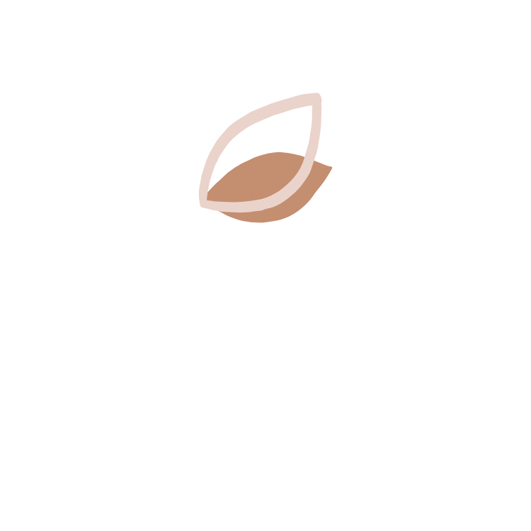

{ align=center width="300" }

# **Tratamentos naturais para o climatério e a menopausa**

{ align=right width="250" .hero-avatar }

_"Uma abordagem integral para uma transição mais tranquila"_

   :material-check: **Elimine as ondas de calor** com ferramentas naturais
    
   :material-check: **Regule seu sono** e tenha noites mais tranquilas
    
   :material-check: **Amenize oscilações de humor** e **irritabilidade** para viver seus dias com mais leveza
    
   :material-check: **Recupere o conforto e o bem-estar íntimo**, reduzindo o **ressecamento vaginal**

[Conheça meu acompanhamento](#contato){ .md-button .md-button--primary }

---

## :material-play-circle: **Climatério e menopausa com práticas naturais**

  <iframe src="https://www.youtube.com/embed/BR0vg-rcyB8" 
          style="position: absolute; top: 0; left: 0; width: 100%; height: 100%; border: 0;" 
          allowfullscreen 
          title="Climatério e menopausa com práticas naturais">
  </iframe>

---

## :material-heart: **Saúde e vitalidade**

A menopausa é uma **etapa natural** da vida de toda mulher. Em algumas culturas milenares, representa a transição para uma **fase de maior sabedoria**.

Não quero romantizar: não é uma mudança fácil. Mas quanto mais **suporte** você der ao seu corpo, **menor será a turbulência**.

Com a **abordagem adequada** e o auxílio de **ferramentas naturais**, é possível viver esse momento com mais **saúde**, **prazer** e **vitalidade**.

[Saiba mais](#sobre){ .md-button }

---

## :material-account-heart: O que minhas pacientes dizem

!!! quote "Transformação em apenas um mês"
    
    "O tratamento para amenizar os sintomas da menopausa tem sido incrível, em apenas um mês vi mudanças significativas no meu corpo e no meu emocional, sentindo mais leveza, melhora do sono e da qualidade de vida! A medicina Ayurveda realmente funciona podem confiar! Só tenho a agradecer por todo carinho e acolhimento!"

!!! quote "Climatério aos 30 anos"
    
    "Procurei a Jéssica principalmente para lidar com os sintomas do climatério, que vinham me afetando bastante, até porque aos 30 anos isso é de 1 em 1 milhão né… calorões intensos, perda de libido, cansaço, falta de disposição e outros desconfortos que pareciam estar tomando conta da minha vida."

!!! quote "Melhora do sono na menopausa"
    
    "Estou na menopausa há 3 anos e o que mais me incomodava era a dificuldade de dormir. A Jéssica foi um presente de Deus na minha vida pra me ajudar com esse desconforto. Uma pessoa extremamente doce e acolhedora."

---

## :material-account-circle: **Sou Jéssica Gontijo, muito prazer** {#sobre}

{ align=left width="300" .about-photo }

### :material-leaf: **Minha missão**

Entusiasta do autoconhecimento e da autonomia da mulher, sou **bacharel em Naturologia** e **especializada em Medicina Ayurvédica**. 

Desde sempre me interessei muito pelo meu universo interno e pelas mudanças profundas que podem acontecer quando nos colocamos no centro de nossas vidas.

### :material-heart-pulse: **Minha abordagem**

Acredito que todo movimento em direção à nutrição de nossos corpos é recompensada. Apaixonada pelos recursos que a natureza nos oferece, acompanho mulheres no período do climatério e da menopausa utilizando essas ferramentas.

Não somente para o alívio dos desconfortos que podem surgir nessa fase, mas também para que essa transição seja um **movimento de apropriação de si**.

---

## :material-form-select: Solicite um contato {#contato}

Preencha o formulário abaixo que eu te envio uma mensagem por whatsapp e avaliamos juntas se esse tratamento pode te ajudar.

#### Como funciona o acompanhamento

- **Consulta inicial personalizada** - Realizamos uma avaliação completa do seu histórico de saúde, sintomas atuais e objetivos.
    
- **Plano individualizado** - Você receberá em formato PDF após a consulta um plano que inclui prescrição de fitoterápicos, orientações estratégicas para ajustes na rotina e práticas de autocuidado.
    
- **Acompanhamento contínuo** - Encontros quinzenais ou semanais, conforme suas necessidades, com ajustes sempre que necessário para que o processo seja sustentável e adaptado à sua evolução.

### Formulário de Contato

!!! warning "Atenção"
    
    Por enquanto, entre em contato diretamente pelos canais abaixo. O formulário será implementado em breve.

---

## :material-phone: Contato

**WhatsApp** • [(31) 99292-2463](https://wa.me/5531992922463)

**Instagram** • [@jessicagontijo.naturologia](https://instagram.com/jessicagontijo.naturologia)

---

## :material-map-marker: Informações Profissionais

**Jéssica Gontijo**  
Registro ABRANA: 100443  
CBO: 2263-20

---

---

**_Uma abordagem natural e integral para viver a menopausa com mais equilíbrio, bem-estar e qualidade de vida._**
